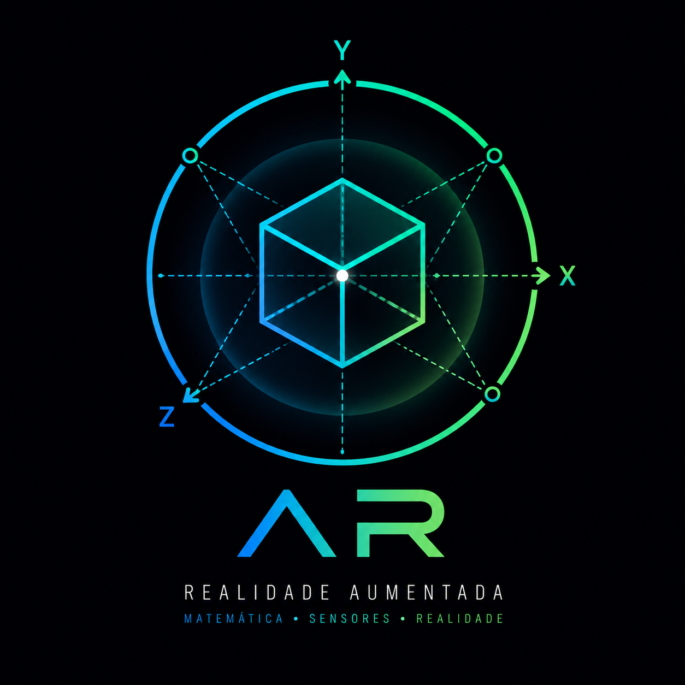

# 🎓 Feira de Matemática: Realidade Aumentada



<div align="center">


**Como celulares conseguem entender o espaço usando matemática?**

Um projeto educativo interativo que demonstra como a Realidade Aumentada funciona através de sensores, matemática e cálculos espaciais em tempo real.

[🌐 Acesse o Site](http://feira-matematica.onrender.com) • [🚀 Começar](#-começar) • [🤝 Contribuir](#-contribuir)

</div>

---

## 📚 Sumário

- [🎯 Sobre o Projeto](#-sobre-o-projeto)
- [🌟 Características Principais](#-características-principais)
- [📋 Estrutura do Projeto](#-estrutura-do-projeto)
- [🎨 Seções do Site](#-seções-do-site)
- [🚀 Começar](#-começar)
  - [Pré-requisitos](#pré-requisitos)
  - [Instalação Local](#instalação-local)
- [🐳 Deploy com Docker](#-deploy-com-docker)
- [📡 API REST](#-api-rest)
- [🎮 Usando o Simulador de Sensores](#-usando-o-simulador-de-sensores)
- [📱 Compilar Aplicativo Android](#-compilar-aplicativo-android)
- [🛠️ Stack Tecnológico](#%EF%B8%8F-stack-tecnológico)
- [📊 Banco de Dados](#-banco-de-dados)
- [🎓 Conceitos Educativos](#-conceitos-educativos)
- [🤝 Contribuir](#-contribuir)
- [👥 Autores](#-autores)
- [🌐 Como Acessar](#-como-acessar)
- [🐛 Reportar Bugs](#-reportar-bugs)
- [💡 Sugestões de Melhorias](#-sugestões-de-melhorias)
- [📞 Suporte](#-suporte)

---

## 🎯 Sobre o Projeto

Este é um **projeto educativo completo** desenvolvido para uma Feira de Matemática, com o objetivo de desmistificar a **Realidade Aumentada (RA)**. Ele explora de forma prática e interativa como os smartphones modernos utilizam uma combinação de sensores internos, princípios matemáticos avançados e algoritmos de rastreamento espacial para compreender e interagir com o mundo real. O projeto é uma ferramenta didática que demonstra a aplicação da matemática e da física em tecnologias inovadoras, como a RA, tornando conceitos complexos acessíveis e envolventes para estudantes e entusiastas.

---

## 🌟 Características Principais

- **🎨 Design Minimalista Moderno**: Interface de usuário limpa e intuitiva, construída com **Tailwind CSS 4** e componentes **Radix UI**, proporcionando uma experiência visual agradável e responsiva.
- **⚡ Demonstração ao Vivo**: Inclui um simulador de sensores em tempo real diretamente no navegador, permitindo a visualização imediata dos dados e seus efeitos.
- **📱 Integração com Sensores Reais**: Capacidade de receber dados de acelerômetro e giroscópio de dispositivos Android via **API REST**, conectando o mundo físico ao digital.
- **🗄️ Backend Robusto**: Desenvolvido com **Express.js** e **MySQL** para persistência de dados, garantindo uma base sólida e escalável para o projeto.
- **🐳 Containerizado**: Configuração **Dockerfile** e **docker-compose.yml** prontas para deploy em plataformas como Render, Vercel, ou qualquer ambiente de contêiner, facilitando a portabilidade e o gerenciamento.
- **📊 Visualização 3D Interativa**: Representação visual em 3D do movimento do dispositivo, que ajuda a compreender a relação entre os dados dos sensores e a orientação espacial.
- **🎓 Conteúdo Educativo Abrangente**: Sete seções dedicadas a explicar os conceitos fundamentais da Realidade Aumentada, sensores e a matemática envolvida, tornando o aprendizado mais completo.

---

## 📋 Estrutura do Projeto

```
feira-matematica/
├── 📁 client/                    # Frontend React + Vite
│   ├── src/
│   │   ├── pages/               # Páginas principais
│   │   │   ├── Home.tsx         # Página inicial (Hero + O que é AR)
│   │   │   ├── Sensors.tsx      # Explicação de sensores
│   │   │   ├── Math.tsx         # Conceitos matemáticos
│   │   │   ├── Demo.tsx         # Demonstração ao vivo com simulador
│   │   │   ├── Quiz.tsx         # Quiz interativo
│   │   │   └── Participants.tsx # Equipe do projeto
│   │   ├── components/          # Componentes reutilizáveis
│   │   │   ├── SensorSimulator.tsx  # Simulador de sensores
│   │   │   ├── Header.tsx       # Navegação
│   │   │   ├── Footer.tsx       # Rodapé
│   │   │   └── ...
│   │   └── index.css            # Estilos globais
│   └── vite.config.ts
│
├── 📁 server/                    # Backend Express.js
│   ├── index.ts                 # Servidor principal
│   ├── routes/
│   │   └── sensorsRoutes.ts     # API de sensores
│   ├── socket.ts                # WebSocket (Socket.io)
│   └── db.ts                    # Conexão com banco de dados
│
├── 📁 drizzle/                   # Schema do banco de dados
│   └── schema.ts                # Tabela de sensores
│
├── 📁 api/                       # Funções serverless (opcional)
├── Dockerfile                    # Build em 2 estágios
├── docker-compose.yml           # Setup local com MySQL
├── package.json                 # Dependências
└── tsconfig.json                # Configuração TypeScript
```

---

## 🎨 Seções do Site

O projeto é dividido em sete seções interativas, cada uma focada em um aspecto específico da Realidade Aumentada e seus fundamentos:

### 1️⃣ **Home (Página Inicial)**
- Apresenta uma seção hero com um título impactante e uma breve introdução ao conceito de Realidade Aumentada.
- Oferece navegação intuitiva para as demais seções do site.

### 2️⃣ **Sensores**
- Explica como os dispositivos móveis detectam movimento e orientação no espaço.
- Detalha o funcionamento dos eixos X, Y, Z e a diferença entre acelerômetro e giroscópio.
- Inclui visualizações interativas para facilitar a compreensão.

### 3️⃣ **Matemática**
- Aborda os conceitos matemáticos essenciais que sustentam a Realidade Aumentada.
- Explora tópicos como matrizes de rotação, coordenadas espaciais e as fórmulas aplicadas.
- Apresenta exemplos práticos para ilustrar a teoria.

### 4️⃣ **Demonstração** ⭐ **[PRINCIPAL]**
- **Simulador de Sensores**: Permite controlar manualmente ou simular automaticamente os dados de acelerômetro e giroscópio.
- **Simulação Automática**: Animação realista de movimento para demonstrar o comportamento dos sensores.
- **Gravação em Tempo Real**: Funcionalidade para enviar dados simulados ou reais para o servidor.
- **Visualização 3D**: Um cubo 3D que rotaciona em sincronia com os dados dos sensores, oferecendo uma representação visual clara.
- **Status em Tempo Real**: Exibe informações sobre a conexão, gravação e contagem de registros.

### 5️⃣ **Quiz Interativo**
- Um quiz com 5 questões sobre Realidade Aumentada e sensores para testar o conhecimento do usuário.
- Oferece feedback visual imediato e apresenta a pontuação final.

### 6️⃣ **Impacto e Futuro**
- Discute as diversas aplicações da Realidade Aumentada em diferentes campos, como educação, medicina e entretenimento.
- Aborda as tendências tecnológicas e as oportunidades de carreira relacionadas à RA.

### 7️⃣ **Participantes**
- Apresenta a equipe responsável pelo desenvolvimento do projeto.
- Inclui fotos, funções de cada membro e links para suas redes sociais ou portfólios.

---

## 🚀 Começar

Para configurar e executar o projeto localmente, siga as instruções abaixo:

### Pré-requisitos

Certifique-se de ter as seguintes ferramentas instaladas em seu ambiente de desenvolvimento:

- **Node.js** (versão 18 ou superior) - [Download](https://nodejs.org/)
- **pnpm** (versão 10 ou superior) - Instale via `npm install -g pnpm`
- **MySQL** (versão 8 ou superior) - Alternativamente, utilize o Docker Compose para um setup rápido.
- **Git**

### Instalação Local

#### 1. Clone o repositório

```bash
git clone https://github.com/theeussx/feira-matematica.git
cd feira-matematica
```

#### 2. Instale as dependências

```bash
pnpm install
```

#### 3. Configure as variáveis de ambiente

Crie um arquivo `.env.local` na raiz do projeto com as seguintes variáveis:

```env
# Banco de Dados
DB_HOST=localhost
DB_PORT=3306
DB_USER=app
DB_PASSWORD=password
DB_NAME=feira

# Servidor
NODE_ENV=development
PORT=3000
```

#### 4. Inicie o MySQL (com Docker Compose)

Se você optar por usar o Docker Compose para o MySQL, execute:

```bash
docker-compose up -d
```

#### 5. Rode o servidor de desenvolvimento

```bash
pnpm dev
```

O site estará disponível em: **http://localhost:5173**

---

## 🐳 Deploy com Docker

### Build da Imagem

Para construir a imagem Docker do projeto, execute:

```bash
docker build -t feira-matematica:latest .
```

### Rodando Localmente

Para executar o contêiner Docker localmente, utilize:

```bash
docker run -p 3000:3000 \
  -e DB_HOST=host.docker.internal \
  -e DB_USER=app \
  -e DB_PASSWORD=password \
  -e DB_NAME=feira \
  feira-matematica:latest
```

### Deploy no Render

1. Conecte seu repositório GitHub ao [Render](https://render.com).
2. Crie um novo **Web Service**.
3. Configure as variáveis de ambiente:
   - `DB_HOST` - Host do MySQL
   - `DB_USER` - Usuário do banco
   - `DB_PASSWORD` - Senha do banco
   - `DB_NAME` - Nome do banco
   - `NODE_ENV=production`
4. Clique em **Deploy**.

---

## 📡 API REST

O backend oferece endpoints para interação com os dados dos sensores.

### Endpoints de Sensores

#### Registrar Dados de Sensor

- **URL**: `/api/sensors/record`
- **Método**: `POST`
- **Content-Type**: `application/json`

```bash
POST /api/sensors/record
Content-Type: application/json

{
  "accelerationX": 0.45,
  "accelerationY": -0.32,
  "accelerationZ": 9.8,
  "rotationX": 0.1,
  "rotationY": 0.2,
  "rotationZ": 0.3,
  "deviceId": "S20FE-001"
}
```

**Resposta (200 OK):**
```json
{
  "success": true,
  "id": 123,
  "message": "Dados salvos com sucesso"
}
```

#### Obter Últimos Dados

- **URL**: `/api/sensors/latest`
- **Método**: `GET`
- **Parâmetros**: `deviceId` (opcional, para filtrar por dispositivo)

```bash
GET /api/sensors/latest?deviceId=S20FE-*
```

**Resposta (200 OK):**
```json
{
  "id": 123,
  "accelerationX": 0.45,
  "accelerationY": -0.32,
  "accelerationZ": 9.8,
  "rotationX": 0.1,
  "rotationY": 0.2,
  "rotationZ": 0.3,
  "deviceId": "S20FE-001",
  "createdAt": "2026-05-25T10:30:00Z"
}
```

---

## 🎮 Usando o Simulador de Sensores

### No Navegador

1. Acesse a aba **"Demonstração"** no site.
2. Clique em **"Iniciar Simulação"** para animar automaticamente os sensores.
3. Alternativamente, utilize os **controles deslizantes** para ajustar manualmente os valores de aceleração e rotação:
   - **Aceleração**: Varia de -50 a +50 m/s²
   - **Rotação**: Varia de -360 a +360 rad/s
4. Clique em **"Iniciar Gravação"** para enviar os dados gerados ao servidor.
5. Observe os dados em tempo real na seção "Dados em Tempo Real".

### Com Aplicativo Android (Samsung S20FE)

1. Compile o aplicativo Android seguindo as instruções na seção [📱 Compilar Aplicativo Android](#-compilar-aplicativo-android).
2. Instale o aplicativo no seu dispositivo Samsung S20FE via USB.
3. Abra o aplicativo no celular.
4. Altere a URL do servidor no aplicativo para o domínio onde seu backend está hospedado.
5. Clique em "Iniciar" no aplicativo.
6. Os dados dos sensores do seu celular serão enviados e exibidos em tempo real no site.

---

## 📱 Compilar Aplicativo Android

Este projeto inclui um aplicativo Android que pode ser compilado para interagir com o backend.

### Pré-requisitos

- **Android Studio**
- **Java Development Kit (JDK)** (versão 11 ou superior)
- **Gradle**

### Passos

```bash
# 1. Abra o projeto Android no Android Studio
# Navegue até: Arquivo → Open → selecione a pasta "Android/"

# 2. Aguarde o Gradle sincronizar as dependências do projeto

# 3. Altere a URL do servidor no arquivo build.gradle.kts
# Procure pela linha que define: BuildConfig.SERVER_URL e atualize com o seu domínio

# 4. Compile o projeto para gerar o APK de depuração
./gradlew assembleDebug

# 5. Instale o aplicativo compilado no seu dispositivo Android via ADB
adb install app/build/outputs/apk/debug/app-debug.apk
```

---

## 🛠️ Stack Tecnológico

Este projeto foi construído utilizando uma combinação de tecnologias modernas para frontend, backend e DevOps:

### Frontend
- **React 19**: Biblioteca JavaScript para construção de interfaces de usuário interativas.
- **TypeScript 5.6**: Superset do JavaScript que adiciona tipagem estática, melhorando a robustez do código.
- **Vite 7**: Ferramenta de build rápida para desenvolvimento frontend.
- **Tailwind CSS 4**: Framework CSS utilitário para estilização rápida e responsiva.
- **Radix UI**: Biblioteca de componentes de UI acessíveis e personalizáveis.
- **Framer Motion**: Biblioteca para animações fluidas e de alto desempenho.
- **Recharts**: Biblioteca de gráficos para visualização de dados.

### Backend
- **Express.js 4.21**: Framework web minimalista e flexível para Node.js.
- **Node.js 18+**: Ambiente de execução JavaScript server-side.
- **MySQL 8**: Sistema de gerenciamento de banco de dados relacional.
- **Drizzle ORM**: ORM TypeScript moderno e leve para interagir com o banco de dados.
- **Socket.io**: Biblioteca para comunicação em tempo real bidirecional baseada em eventos.

### DevOps
- **Docker**: Plataforma para desenvolver, enviar e executar aplicações em contêineres.
- **Render**: Plataforma de nuvem para deploy e hospedagem de aplicações.
- **GitHub**: Plataforma de hospedagem de código-fonte para controle de versão e colaboração.

---

## 📊 Banco de Dados

O banco de dados MySQL armazena os dados dos sensores na tabela `sensorData`.

### Tabela: `sensorData`

```sql
CREATE TABLE sensorData (
  id INT AUTO_INCREMENT PRIMARY KEY,
  accelerationX DECIMAL(10, 4),
  accelerationY DECIMAL(10, 4),
  accelerationZ DECIMAL(10, 4),
  rotationX DECIMAL(10, 4),
  rotationY DECIMAL(10, 4),
  rotationZ DECIMAL(10, 4),
  deviceId VARCHAR(255),
  createdAt TIMESTAMP DEFAULT CURRENT_TIMESTAMP
);
```

---

## 🎓 Conceitos Educativos

### O que é Realidade Aumentada?

Realidade Aumentada (RA) é uma tecnologia que sobrepõe elementos digitais, como imagens 3D e informações interativas, ao ambiente físico em tempo real. Diferente da Realidade Virtual (RV), que imerge o usuário em um mundo totalmente artificial, a RA enriquece a percepção do mundo real com camadas de conteúdo virtual, geralmente através da câmera de um smartphone ou tablet.

### Como Funciona?

O funcionamento da Realidade Aumentada envolve uma série de etapas coordenadas:

1.  **Sensores**: Acelerômetros e giroscópios internos do dispositivo capturam dados de movimento e orientação.
2.  **Matemática**: Algoritmos complexos utilizam esses dados para calcular a posição e orientação exatas do dispositivo no espaço.
3.  **Processamento**: O dispositivo processa as informações para construir um mapa virtual do ambiente e entender sua geometria.
4.  **Renderização**: Objetos 3D virtuais são então renderizados e posicionados de forma precisa no espaço real, alinhados com a perspectiva da câmera.
5.  **Câmera**: A imagem combinada (mundo real + objetos virtuais) é exibida na tela do dispositivo, criando a ilusão de que os elementos digitais fazem parte do ambiente.

### Fórmulas Matemáticas Essenciais

#### Aceleração

A aceleração é a taxa de variação da velocidade de um objeto ao longo do tempo. É fundamental para entender o movimento linear do dispositivo.

```
a = Δv / Δt
```

Onde:
- `a` é a aceleração
- `Δv` é a variação da velocidade
- `Δt` é a variação do tempo

#### Rotação (Matriz 3D)

Para representar a orientação e rotação de um objeto no espaço 3D, são utilizadas matrizes de rotação. Elas permitem transformar coordenadas de um sistema de referência para outro.

```
R = [cos(θ)  -sin(θ)  0]
    [sin(θ)   cos(θ)  0]
    [0        0       1]
```

Esta é uma matriz de rotação 2D simplificada. Em 3D, as matrizes são mais complexas e envolvem rotações em torno dos eixos X, Y e Z (roll, pitch, yaw).

#### Coordenadas Espaciais (Transformação)

Para posicionar objetos virtuais no mundo real, é necessário transformar suas coordenadas do sistema de referência do objeto para o sistema de referência do mundo. Isso é feito através de uma combinação de rotação e translação.

```
P' = R × P + T
```

Onde:
- `P'` são as novas coordenadas do ponto no sistema de referência do mundo
- `R` é a matriz de rotação
- `P` são as coordenadas originais do ponto no sistema de referência do objeto
- `T` é o vetor de translação (posição)

---

## 🤝 Contribuir

Contribuições são muito bem-vindas! Se você deseja aprimorar este projeto, siga os passos abaixo:

1.  **Fork** o repositório para sua conta GitHub.
2.  **Crie uma nova branch** para sua feature ou correção de bug: (`git checkout -b feature/AmazingFeature`).
3.  **Commit** suas mudanças com mensagens claras e descritivas: (`git commit -m 'Add some AmazingFeature'`).
4.  **Push** sua branch para o repositório remoto: (`git push origin feature/AmazingFeature`).
5.  **Abra um Pull Request** detalhando suas alterações e o problema que ele resolve ou a funcionalidade que adiciona.

### Diretrizes de Contribuição

- Mantenha o código limpo, legível e bem documentado.
- Utilize **TypeScript** para garantir a segurança de tipos e a manutenibilidade do código.
- Siga o padrão de código existente no projeto.
- Escreva testes para novas funcionalidades sempre que possível.
- Atualize a documentação (incluindo este README) conforme necessário para refletir suas mudanças.

---

## 👥 Autores

Este projeto foi desenvolvido com ❤️ pela equipe da Feira de Matemática 2026.

**Participantes:**
- [Mateus Henrique](https://theeussx.vercel.app) - Desenvolvedor Full Stack, Designer, Suporte, Apresentador 1
- Arthur Felipe - Desenvolvedor do Aplicativo, Apresentador 2
- Matheus Gabriel - Pesquisador, Apresentador 4
- Rivaldo - Orientador
- Luiz Henrique - Apresentador 3
- Alisson Felipe - Apresentador 5

---

## 🌐 Como Acessar

### Online

Você pode acessar a versão online do projeto através dos seguintes links:

- **URL Principal**: [https://feira-matematica.onrender.com](https://feira-matematica.onrender.com)
- **Aba de Demonstração**: [https://feira-matematica.onrender.com/demo](https://feira-matematica.onrender.com/demo)

### Localmente

Após seguir as instruções de [Instalação Local](#instalação-local), você pode iniciar o servidor de desenvolvimento e acessar o projeto em:

```bash
pnpm dev
# Acesse: http://localhost:5173
```

---

## 🐛 Reportar Bugs

Se você encontrar algum bug ou comportamento inesperado, por favor, abra uma [Issue no GitHub](https://github.com/theeussx/feira-matematica/issues) com as seguintes informações:

- Uma descrição clara e concisa do problema.
- Passos detalhados para reproduzir o bug.
- O comportamento esperado versus o comportamento atual.
- Screenshots ou gravações de tela (se aplicável).
- Informações sobre o seu ambiente (Sistema Operacional, navegador, versão do Node.js, etc.).

---

## 💡 Sugestões de Melhorias

Tem uma ideia para melhorar o projeto ou adicionar uma nova funcionalidade? Sinta-se à vontade para abrir uma [Discussion](https://github.com/theeussx/feira-matematica/discussions) ou uma [Issue no GitHub](https://github.com/theeussx/feira-matematica/issues) com a tag `enhancement`.

---

## 📞 Suporte

Para dúvidas gerais ou necessidade de suporte, por favor:

1.  Verifique as [Issues existentes](https://github.com/theeussx/feira-matematica/issues) para ver se sua pergunta já foi respondida.
2.  Abra uma nova [Discussion](https://github.com/theeussx/feira-matematica/discussions) no repositório.

---

<div align="center">

**Desenvolvido com 💙 para a Feira de Matemática 2026**

⭐ Se este projeto foi útil, considere dar uma estrela! ⭐

[⬆ Voltar ao Topo](#-feira-de-matemática-realidade-aumentada)

</div>
